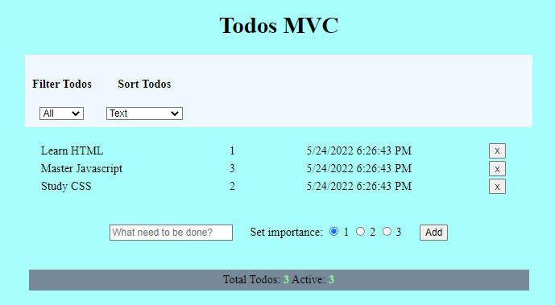

# Todos-MVC
✅ A small scale task management app. Written as an exercise for practicing MVC-architecture and CRUD operations. My first ever MVC and CRUD project 😍.

## General Information
This project was an exercise taken as part of the Coding Academy web-development course. It was one of the first projects performed and was aimed for practicing MVC-architecture and CRUD operations.

## Technologies Used
- HTML5
- CSS3
- JavaScript - ES6

## Screenshots

## Usage
- View all your tasks in the todo-list.
- Sort by text, time or importance.
- Filter by activity status. 
- Add tasks or remove tasks.

## Project Status
Project is: _no longer being worked on_.  
Reason: Moved to work on higher scale projects.

## Room for Improvement
- Add features.
- Improve style.
